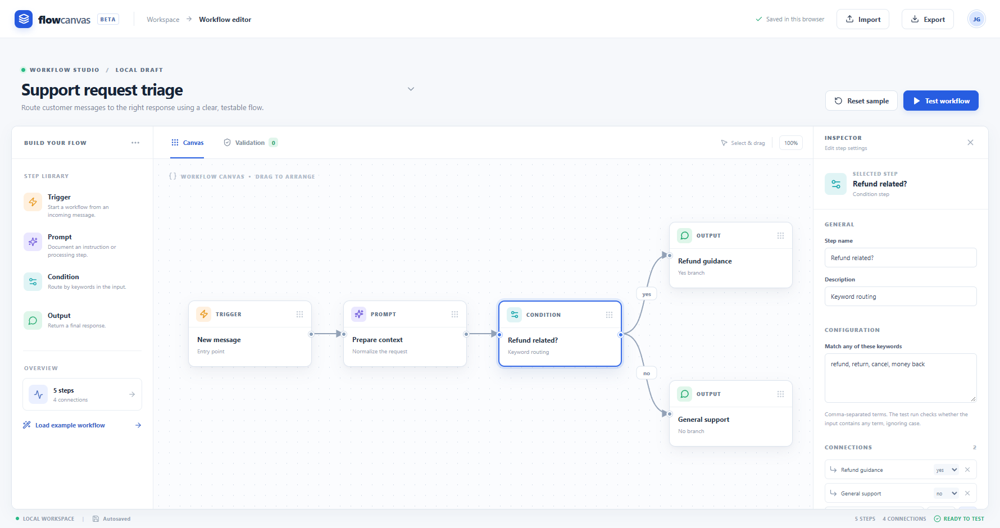

# Flow Canvas

A visual workspace for designing and testing small assistant workflows. Build a flow from triggers, prompt steps, keyword conditions and outputs; inspect structural issues; then run a sample message through the graph. Everything works locally in the browser.

## Features

- Add, edit, duplicate, remove and drag steps on a canvas.
- Connect steps with explicit yes/no branches for conditions.
- Validate missing configuration, unreachable steps, broken links and incomplete branches.
- Run a deterministic sample message and inspect its path and final response.
- Autosave in browser storage; import and export versioned JSON.

The sample workflow demonstrates customer support triage. The local runner matches keywords; prompt steps document instructions but do not call an LLM or external API. This keeps the demo reproducible without credentials.

## Run locally

Requires Node.js 22 or newer and pnpm 11.

    pnpm install
    pnpm build
    pnpm preview

Open the URL printed by Vite. For development on a normal local machine, use `pnpm dev`.

## Architecture

- `src/App.tsx`: editor, canvas and inspector.
- `src/model.ts`: workflow schema, import checks, validation and test runner.
- `src/styles.css`: responsive interface.
- `src/main.tsx`: React entry point.

Built with React, TypeScript, Vite and Lucide icons. There is no backend, account setup or API key. The JSON format includes a version field; imports are checked and size-limited. The runner stops loops instead of hanging.

## Deployment

Build with `pnpm build` and serve `dist/` on any static host. For Netlify, use `pnpm build` as the build command and `dist` as the publish directory.

## License

MIT. See [LICENSE](LICENSE).
